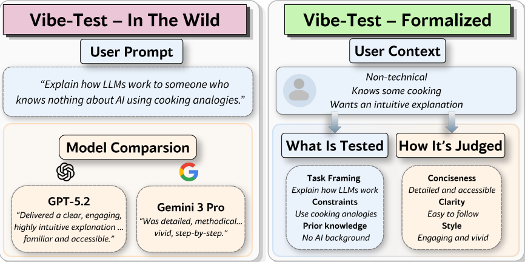

Three seemingly disconnected events occurred this week that tell you exactly where the state of applied artificial intelligence currently sits. First, the [Australian Federal Court issued a new Practice Note](https://www.theguardian.com/law/2026/apr/16/australia-federal-court-warning-lawyers-ai-artificial-intelligence#:~:text=The%20federal%20court%20of%20Australia,AI%20errors%20frustrate%20court%20cases.) explicitly warning legal practitioners of their liability when using AI, mandating that outputs must mirror human memory and verify all citations. Second, a [psychological study published in PsyPost](https://www.psypost.org/new-research-links-personality-traits-to-confidence-in-recognizing-artificial-intelligence-deception/) demonstrated that human personality traits—specifically agreeableness and conscientiousness—drastically distort our capacity to recognize AI deception, creating systemic blind spots. Finally, researchers from Israel proposed a [framework for formalizing "vibe-testing"](https://arxiv.org/pdf/2604.14137v1) attempting to convert the highly subjective feeling of an LLM's usefulness into a structured, user-aware evaluation metric. 

If you view these updates through the lens of a product manager or a deployment architect, they look like the natural industrial maturation of an experimental technology. They look like guardrails. But if you look at them through the lens of systems engineering, they represent an industry-wide attempt to patch a fundamental architectural failure at the symptom layer.

The engineering tension buried beneath these headlines is the undeniable collision between probabilistic generation and deterministic expectations. We are attempting to integrate stochastic text compressors into environments that unconditionally require referential integrity, and when the hardware and the software cannot bridge that gap, we are simply throwing human cognitive labor at the problem and calling it a "feature."

To be fair to the optimists pushing for deployment, the practical case is completely correct within the bounds of a shipping cycle. If you are an enterprise AI lead responsible for rolling out tooling to thousands of employees today, you cannot afford to wait for neuro-symbolic breakthroughs. You have to ship. In that operational reality, the formalization of vibe-testing is a massive leap forward. Traditional static benchmarks like MMLU or HumanEval are virtually useless for predicting how a model will perform in the specialized context of an internal legal department or a specialized engineering team. Translating the anecdotal "vibe" into an automated, role-specific evaluation pipeline allows a company to personalize the model's subjective alignment at scale. 

Furthermore, the legal and psychological findings provide an actionable framework for risk mitigation. Acknowledging that humans are naturally bad at detecting plausible hallucinations allows you to design better UI/UX. You can build adversarial nudges into your interface that deliberately interrupt the workflow, forcing users out of passive consumption and into active verification. The Australian mandate clarifies exactly where liability sits, presenting a clear path: use the generative model purely for drafting efficiency, but institute a mandatory human-in-the-loop (HITL) compliance checkpoint. 

But at **Bias Layer**, we evaluate architectures by their structural integrity and their fundamental economics, and from a systems perspective, treating the human user as the control loop for an algorithm is not robustness—it is compounded uncertainty.

Across the legal directives, the psychological warnings, and the technical attempts to capture "vibes," the industry is deploying post-hoc mitigation layers because the underlying primitive of the Large Language Model lacks any internal control over its own generation boundaries. An LLM cannot enforce a [closed world assumption](https://arxiv.org/pdf/2510.05116v1). It cannot guarantee that a generated citation actually maps to a physical database at inference time. It offers distributional plausibility—text that successfully predicts the semantic sequence of a correct answer—rather than symbolic correctness. We are attempting to retrofit reliability onto an abstraction that was mathematically designed to approximate, not verify.

When you look at this through the lens of inference economics, the reality of the post-hoc patch becomes terrifying. The core promise of enterprise AI is that it drastically reduces the cost and timeline of producing cognitive work. But when the system is inherently non-deterministic and the stakes are high, every single downstream inference requires a secondary, human inference. We are building systems where the human must meticulously audit what the machine generated, essentially double-checking math produced by a calculator that we know hallucinates twenty percent of the time. 

Instead of driving costs toward zero, this creates a cost inversion. The human validator spends significant latency unpacking the reasoning of the model, and because individuals possess varying degrees of psychological agreeableness and fatigue, fake citations inevitably slip through the verification net. Those corrupted outputs get ingested back into downstream systems, causing classic error amplification in a probabilistic pipeline. You have doubled the latency and injected unmeasurable risk, effectively creating a system where the generator is unreliable, the human validator is highly erratic, and the surrounding enterprise assumes complete reliability. 

This is not easily solvable because the problem is hardware-bound. The entire pipeline of modern AI—from the transformer architecture down to the underlying GPU clusters—is ruthlessly optimized for throughput, parallel sampling, and approximate reasoning. Constraining decoding to enforce hard guarantees or bolting on symbolic verification layers drastically reduces that throughput and shatters the economic efficiency of the hardware. The result is that the industry ignores the root structural deficit and continues to build more alignment layers and auditing frameworks. 

Looking ahead over the next 12 months, this tension is going to create a massive, highly profitable subset of the software industry dedicated entirely to "AI Auditing" and sophisticated HITL middleware platforms. We will see enterprise budgets shift away from raw model API calls and toward robust verification platforms that automate the vibe-testing and mandate citation checking. The deployment layer will succeed in creating workflows that abstract the unreliability away from the end consumer.

However, the hidden cost explosion of running two parallel inference layers—one silicon, one biological—will eventually force a reckoning for organizations operating at scale. As companies measure the actual ROI of human-verified generative drafting, they will find that the margins simply do not justify the risk. This will catalyze the inevitable reframing: LLMs will be demoted from general-purpose reasoning agents into simple conversational interfaces. The heavy lifting of enterprise technology will pivot back toward hybrid architectures, where the neural network's only job is to intelligently parse user intent and pass requests down to deterministic, verifiable execution layers that cannot hallucinate because their generation boundaries are physically closed.
