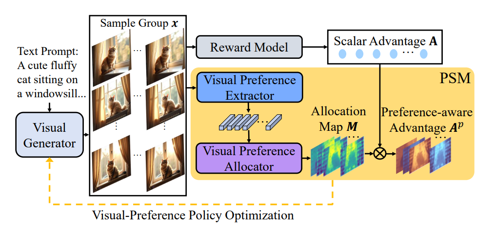

The release of **[Seeing What Matters: Visual Preference Policy Optimization (ViPO) for Visual Generation](https://arxiv.org/pdf/2511.18719)** is a prime example of where the generative AI industry stands right now: we are getting exceptionally good at optimizing systems we don't fully control.

To understand ViPO, you have to understand the bottleneck of moving from generic prompt-to-image demos to production-grade visual assets. Until now, the industry standard for post-training visual models was [Group Relative Policy Optimization (GRPO)](https://arxiv.org/pdf/2402.03300), a technique that treats an entire image or video sequence as a single data point receiving a single scalar score. If an image is a masterpiece but features a six-fingered hand, or a ten-second video is perfect save for a half-second background flicker, a scalar reward simply tells the model "this output is bad." It fails to communicate *where* or *why*. This is "scalar blindness."

ViPO fixes this blindness. It introduces a Perceptual Structuring Module (PSM) that breaks down rewards into spatially and temporally aware advantage maps. Instead of a single score for the entire output, the model receives surgical, pixel-level feedback. It is a transition from holistic nudging to structured, region-wise preference signals. 

On the surface, this is a massive operational win. But if we peel back the layers, it reveals a profound architectural tension: are we building reliable systems, or are we just getting infinitely better at steering randomness?

A pragmatic AI engineering lead will look at ViPO and implement it tomorrow, and for good reason. It is the exact tool needed for real-world deployment in the "Post-Training War." 

The most attractive quality of ViPO is its plug-and-play nature. It is architecture-agnostic, integrating seamlessly with Diffusion Transformers (DiT) like FLUX or standard U-Nets without requiring a rewrite of the core training loop. Because it builds on top of GRPO—which avoids the memory overhead of a separate value function network—it keeps memory footprints lean while providing a far more informative learning signal.

More importantly, this makes video generation viable. As the industry scales from static images to heavy temporal models, holistic rewards become computationally absurd. A ten-second video contains thousands of spatial regions across hundreds of frames. By introducing a reward model that can specifically isolate and punish temporal inconsistency in the exact frames where flickering occurs, ViPO introduces the granular feedback loop essential for professional-grade stability. It even enhances out-of-distribution generalization, as the model learns to prioritize universally preferred features—clear faces, consistent lighting—rather than just memorizing a distribution of high-scoring holistic images.

From a deployment perspective, ViPO is the correct next step. It is mathematically sound and immediately useful. 

But from the perspective of systems architecture, it is a textbook case of a Band-Aid over a broken abstraction.

If we zoom out, the modern generative stack generally amounts to a stochastic foundation (diffusion or autoregressive generation) covered in a thick layer of RL post-training alignment. The fundamental flaw here is that we are trying to impose control *after* generation, rather than baking it into the generation step itself.

ViPO explicitly avoids solving this abstraction problem. While it upgrades the specificity of the reward, the generation process remains fundamentally sampling-based. The optimization relies on high-variance policy gradients, and the final outcome is inherently non-repeatable. You cannot build a structurally reliable engineering system on the premise of "we encourage these pixels to look right." You need guarantees: "this input produces this exact output." ViPO doubles down on probabilistic outputs and reward shaping. It represents better steering of randomness, not the elimination of it.

This lack of control exposes the deeper issue. A diffusion model has no native, programmatic concept of 3D structure, geometric invariants, or compositional rules. True control systems look like constraint solvers, programmatic rendering pipelines, or symbolic planners. Instead, by weighting advantages spatially and hoping the policy internalizes those weights, ViPO defaults to indirect, aesthetic nudging. We are still not specifying invariants; we are just rewarding the pixels we happen to like more.

This is where inference economics and hardware reality come into sharp conflict with the trajectory of alignment research.

Modern accelerators are designed for dense matrix operations, predictable compute graphs, and batched execution. ViPO introduces fine-grained reward maps, spatial weighting logic, and sequential, high-variance RL loops that break uniform tensor operations and introduce irregular memory access patterns. 

Furthermore, while ViPO might increase the quality per sample, it ignores the cost per usable output in a deployment setting. True production systems care about latency, determinism (preventing retry loops), and compute predictability. Diffusion models already suffer from requiring multi-step sampling. Adding computationally intensive, region-wise reward logic during training only reinforces our reliance on an architecture that fundamentally demands extensive, expensive compute to brute-force a usable result.

The industry keeps asking "how do we better optimize diffusion models?" entirely ignoring the superior question: "why are we relying on architectures that require multi-step stochastic rollouts at all?"

ViPO is clever, but it is ultimately a local maximum. It effectively upgrades a blurry reward signal into a much sharper one, allowing teams to ship temporally stable video and higher-fidelity images today.

Over the next twelve months, ViPO—or derivatives of region-wise preference optimization—will absolutely become the standard for open-weight and proprietary visual models. It represents the pinnacle of the RL-alignment era. But it will also highlight the ceiling of stochastic generation. As the compute costs of routing, alignment, and multi-step inference continue to scale, the industry will be forced to reckon with the limits of indirect control. 

This paper shows that we have perfected the art of the patch. The next phase will be abandoning the patched foundation entirely, shifting toward deterministic, post-diffusion architectures where control is a first-class primitive, not a post-training afterthought.
